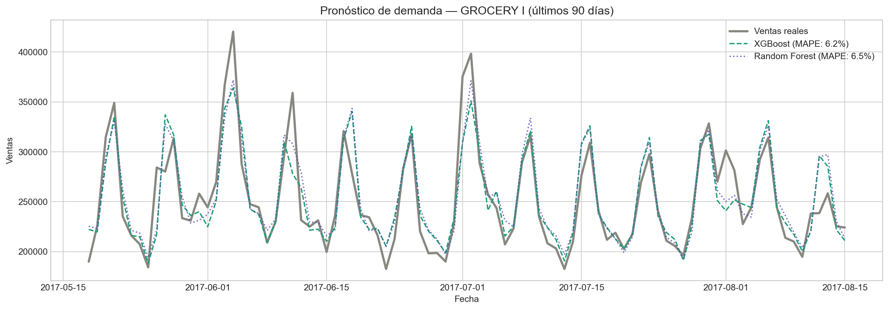
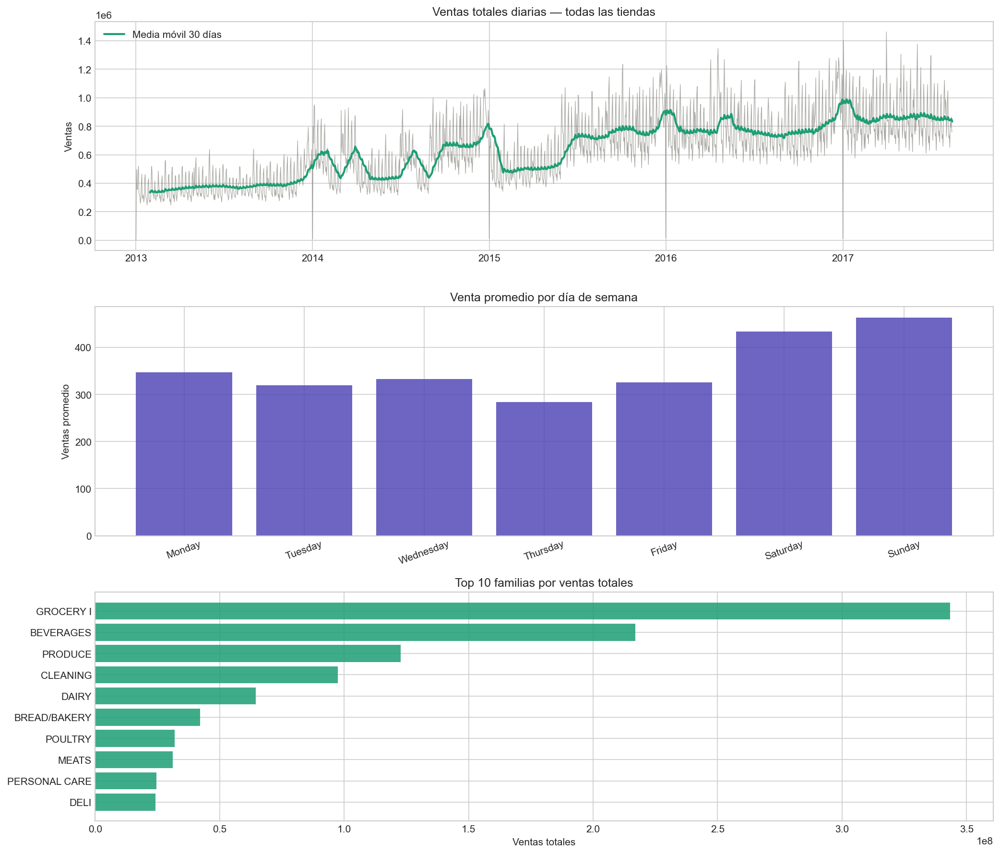

# 📦 Demand Forecasting — Grocery Retail

Modelo de pronóstico de demanda para la categoría **GROCERY I** usando Machine Learning sobre datos reales de 54 tiendas de retail en Ecuador (2013–2017).

---

## 🎯 Objetivo de negocio

Reducir el error de pronóstico de ventas para minimizar **excesos de inventario y faltantes**, alineando la planeación de abasto con la demanda real del mercado.

---

## 📊 Resultados

| Modelo | RMSE | MAPE | Mejora vs Baseline |
|---|---|---|---|
| Baseline (media móvil 7d) | 51,084 | 15.8% | — |
| Random Forest | 22,830 | 6.5% | 58.9% |
| **XGBoost (optimizado)** | **23,938** | **6.2%** | **60.6%** |

> El modelo XGBoost redujo el error de pronóstico de **15.8% a 6.2%**, representando una mejora del **60.6%** respecto al baseline.

---

## 📈 Visualizaciones

### Pronóstico vs Ventas reales (últimos 90 días)


### Análisis exploratorio — Tendencia y estacionalidad


---

## 🔍 Hallazgos clave

- **Estacionalidad semanal clara:** sábado y domingo generan ~35% más ventas que entre semana
- **Ciclo quincenal:** `lag_14` es la variable más importante del modelo, sugiriendo un ciclo de reposición óptimo de 14 días
- **Tendencia creciente:** las ventas totales crecieron ~125% entre 2013 y 2017
- **Promociones relevantes:** `onpromotion` aparece entre las top 10 variables, confirmando su impacto en la demanda

---

## 🛠️ Stack tecnológico

- **Python** — pandas, numpy, matplotlib, seaborn
- **Machine Learning** — scikit-learn, XGBoost
- **Técnicas** — Series de tiempo, lag features, rolling means, GridSearchCV, TimeSeriesSplit
- **Métricas** — RMSE, MAPE

---

## 📁 Estructura del proyecto

```
demand-forecasting-grocery/
├── demand_forecasting.ipynb   # Notebook principal con EDA y modelado
├── eda_overview.png           # Visualizaciones exploratorias
├── real_vs_predict.png        # Resultados del modelo
└── README.md
```

---

## 📂 Dataset

[Store Sales - Time Series Forecasting](https://www.kaggle.com/competitions/store-sales-time-series-forecasting) — Kaggle  
3,000,888 registros | 54 tiendas | 33 familias de productos | 2013–2017

---

## 👤 Autor

**David Encinas Basurto**  
[LinkedIn](https://linkedin.com/in/tu-perfil) · [GitHub](https://github.com/DavidEncinas)

---

*Proyecto desarrollado como parte del Diplomado en Data Science — TripleTen*
